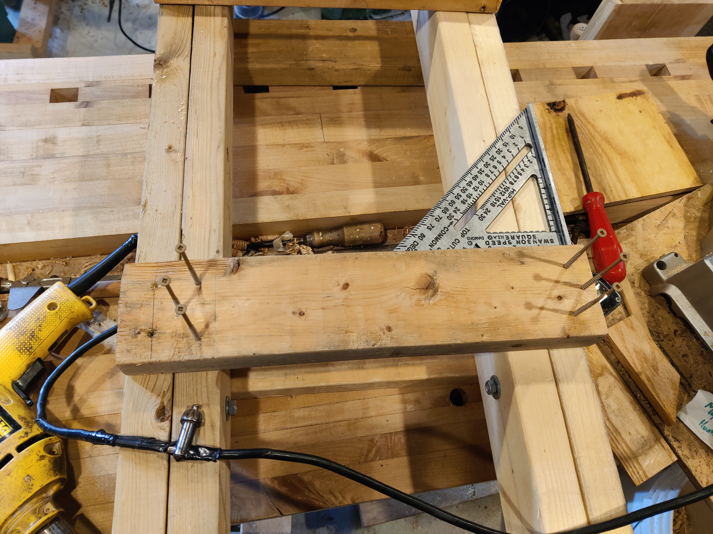
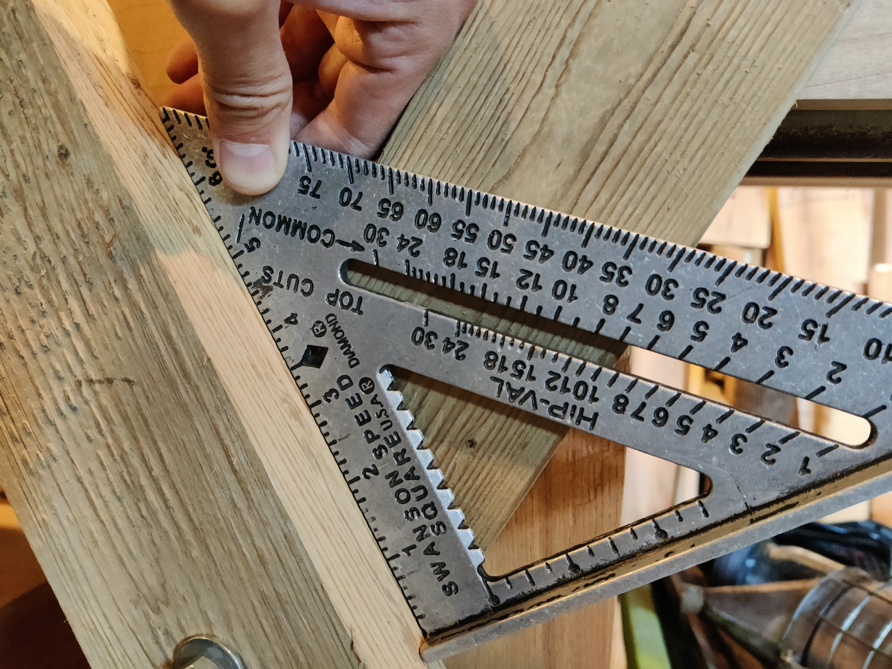

# Mast Horse

Simple design for mast horses using 2x4 lumber.

**Requirements**:
1. Support large mast of a 30+ foot sailing vessels for working on mast preparation or take down
2. Be reasonably compact
3. Avoid catastrophic failure under load, which has happened with either plastic or metal sawhorses

**Solution**:
A folding or scissoring horse made from common lumber. This design is fairly compact and supports the mast in a V shape extension of the legs.

Download designs:
- [FreeCAD Design](assets/MastHorse.FCStd)
- [PDF A4 portrait](assets/mast-horse.pdf)

Design advantages:
 - Each mast horse supports the mast in 4 points, one for each leg, unlike a typical sawhorse which only has one point of contact to accept the load
 - Easy to build with scrap wood

## Instructions

Materials:
- Scrap 2x4 boards
- Two 3/8 inch bolts 3.5 inch long
- Lock nuts
- Washers
- 3in deck Screws

Tools:
 - mitre saw
 - 3/8 inch drill bit and drill
 - speed square
 - clamp

Steps
1. Cut two legs to length. 38 inches each.
2. Mark the centre of the hole. 26in from bottom of leg.
3. Clamp two legs together, bore the hole. Take care to drill squarely for smooth operation.
4. Attach legs together with a bolt, washers, and lock nut.
5. Test the folding of the legs. You may need to flip the boards if they are warped in and causing friction, then reassemble.
6. Repeat the above steps to form the second set of legs.
7. Mark 25in from bottom on side.
8. Align the two pairs of legs on a workbench so they are parallel and 16 inch measured on the outsides. Make sure the 25-inch mark lines up.

9. Screw in the 16in length board to the left* hand legs using three screws for each joint. This is important to line up accurately and squarely. Choose a side of the board with a good edge on the 25in mark, rounded or rough edges can go on the bottom rail. Make sure the one side of the rail is extended past the leg by the thickness of the 2x4 (1.5 inches).
   - *I did put the screws on the left, but I took the photo from the opposite side of the bench. Anyway, It doesn't matter which side as long as you are consistent for all the joints.
10. Screw on the bottom rail aligning the bottom of the board to the 4in mark. This is not as structural as the upper and can use fewer screws.
11. Flip the set of 6 boards and repeat the above steps to attach the final two rails.
12. Adjust the tension of the bolts as needed to ensure proper operation.

## Operation

**Warning**: pinching hazard. As one might expect with any 3 foot scissors, you can get your fingers pinched with some leverage.

Stand the mast-horse on the ground and unfold it. The legs should rest on the top rails firmly, and the resulting angle of the top "V" should be about 30 degrees.

Folded up, it doesn't take up much space:

Workable warped wood. Just make sure the scissoring works if legs are warped. I was able to make use of this by simply aligning the curve out from the adjacent board.

A quick test of the completed set of two horses. This passes end-to-end testing:

With one set upside-down, they stack a little tighter, saving 1.5in, or about 12% of space if needed.

A pair of mast-horses should be enough to support many sizes of masts. Perhaps three sets are needed for some.

## Comparison

Is it worth it? The new sawhorse on the left failed under the weight of a mast. Thankfully, no one was injured, and the only damage was to the sawhorse. I have seen similar with metal frame horses. The wooden mast horse may fail someday as well, and we can repair it and or improve the design. Pull requests are welcome.

